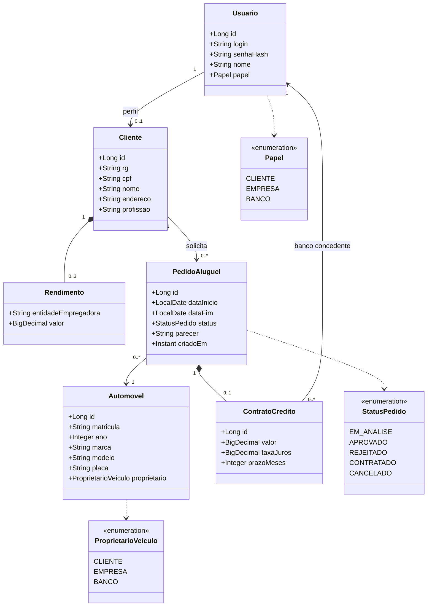
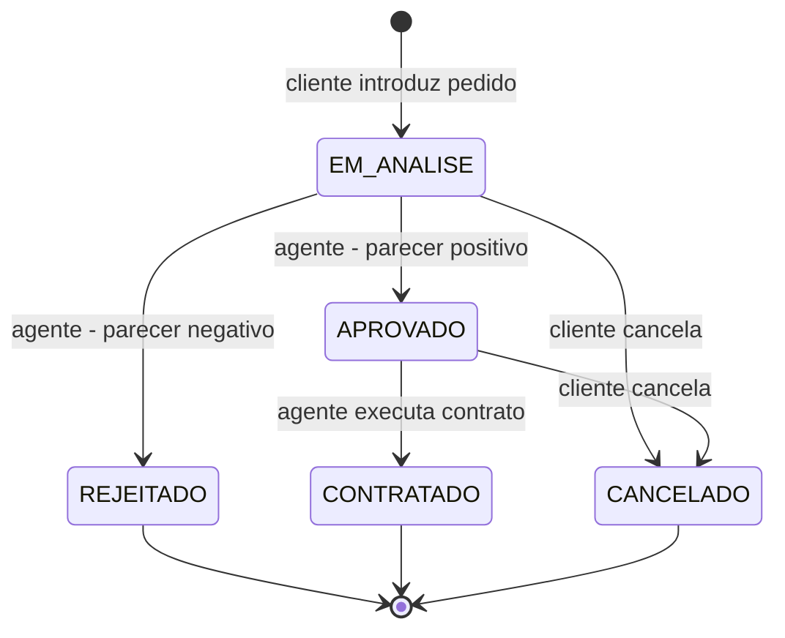

# Diagrama de Classes (Visão Lógica - Modelo)

```mermaid
classDiagram
    class Usuario {
        +Long id
        +String login
        +String senhaHash
        +String nome
        +Papel papel
    }
    class Cliente {
        +Long id
        +String rg
        +String cpf
        +String nome
        +String endereco
        +String profissao
    }
    class Rendimento {
        +String entidadeEmpregadora
        +BigDecimal valor
    }
    class Automovel {
        +Long id
        +String matricula
        +Integer ano
        +String marca
        +String modelo
        +String placa
        +ProprietarioVeiculo proprietario
    }
    class PedidoAluguel {
        +Long id
        +LocalDate dataInicio
        +LocalDate dataFim
        +StatusPedido status
        +String parecer
        +Instant criadoEm
    }
    class ContratoCredito {
        +Long id
        +BigDecimal valor
        +BigDecimal taxaJuros
        +Integer prazoMeses
    }
    class Papel {
        <<enumeration>>
        CLIENTE
        EMPRESA
        BANCO
    }
    class StatusPedido {
        <<enumeration>>
        EM_ANALISE
        APROVADO
        REJEITADO
        CONTRATADO
        CANCELADO
    }
    class ProprietarioVeiculo {
        <<enumeration>>
        CLIENTE
        EMPRESA
        BANCO
    }

    Usuario "1" --> "0..1" Cliente : perfil
    Cliente "1" *-- "0..3" Rendimento
    Cliente "1" --> "0..*" PedidoAluguel : solicita
    PedidoAluguel "0..*" --> "1" Automovel
    PedidoAluguel "1" *-- "0..1" ContratoCredito
    ContratoCredito "0..*" --> "1" Usuario : banco concedente
    Usuario ..> Papel
    PedidoAluguel ..> StatusPedido
    Automovel ..> ProprietarioVeiculo
```

## Máquina de estados do pedido

```mermaid
stateDiagram-v2
    [*] --> EM_ANALISE : cliente introduz pedido
    EM_ANALISE --> APROVADO : agente - parecer positivo
    EM_ANALISE --> REJEITADO : agente - parecer negativo
    EM_ANALISE --> CANCELADO : cliente cancela
    APROVADO --> CONTRATADO : agente executa contrato
    APROVADO --> CANCELADO : cliente cancela
    REJEITADO --> [*]
    CONTRATADO --> [*]
    CANCELADO --> [*]
```
